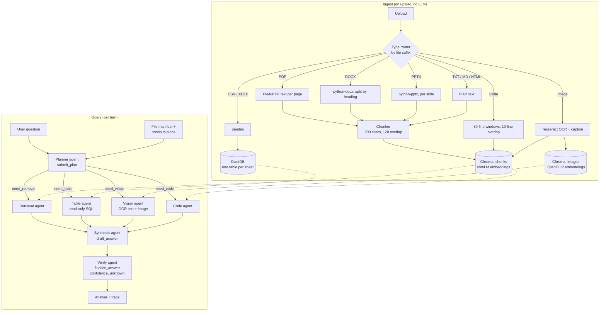

# document_chat

A multi-agent chat system for mixed file sets: PDF, DOCX, PPTX, Markdown, TXT, HTML, CSV, XLSX, images, and source code. You upload files into a conversation and ask questions across them. A planner routes each question to specialist agents (retrieval, table/SQL, vision/OCR, code). Their reports are merged by a synthesis agent and checked by a verification agent, which also returns a confidence score and an "I don't know" flag.

Everything except the LLM runs locally: embeddings, Chroma, DuckDB and SQLite. The default LLM is an open-weight model served by Groq, which has a free API tier. Switching `PROVIDER` to `ollama` makes the whole system run offline with no API key. OpenAI (or any OpenAI-compatible server such as vLLM) and Google Gemini are also supported.

This is a submission for **Option 1: Multi-Format Document/File Chat** of the BD AI Engineer case study.

---

## Contents

- [Architecture](#architecture)
- [Requirements](#requirements)
- [Setup](#setup)
- [Configuration](#configuration)
- [Model providers](#model-providers)
- [Embeddings](#embeddings)
- [Running](#running)
- [Trying it with the test set](#trying-it-with-the-test-set)
- [HTTP API](#http-api)
- [Data on disk](#data-on-disk)
- [Project layout](#project-layout)
- [Design decisions and trade-offs](#design-decisions-and-trade-offs)
- [Known limitations and future work](#known-limitations-and-future-work)
- [Troubleshooting](#troubleshooting)

---

## Architecture

There are two layers. **Ingest** is a deterministic pipeline that runs on upload, with no LLM involved. **Query** is a LangGraph/LangChain agent pipeline that runs per turn.



- Specialists run **in parallel** (`asyncio.gather`), and only the ones the planner selects are run.
- Every agent is a LangChain `create_agent` ReAct loop. Planner, synthesis and verify each have one "recording" tool whose arguments are the structured output: the plan, the draft, and the final answer.
- Tool results are **typed content blocks** (`{"type": "text", ...}` / `{"type": "image", ...}`). This lets the vision tool send the image itself alongside its caption and OCR text.
- **Conversation memory:** the planner sees the plans from earlier turns (intent, subqueries, target files), not the earlier transcripts. This keeps the prompt small while still resolving follow-ups like "and the West region?".
- Every agent step (tool call, tool result, message) is streamed as an event and stored on the assistant message as a `trace`. The UI shows it under "Agent trace".

A longer write-up of the design reasoning is in [`backend/docs/architecture.md`](backend/docs/architecture.md). That file covers why DuckDB was chosen over SQLite/Mongo for tables, the metadata-linking strategy, and the compaction plan.

---

## Requirements

| Requirement | Version | Why |
| --- | --- | --- |
| [uv](https://docs.astral.sh/uv/) | 0.12+ | Dependency and venv management (`uv.lock` is committed) |
| Python | **3.14** (pinned in `backend/.python-version`) | uv downloads it automatically if missing |
| Groq API key *or* [Ollama](https://ollama.com/download) | – | LLM: Groq free tier (default) or fully local Ollama |
| Tesseract OCR binary | 4.x / 5.x | OCR for images. `pytesseract` is only a wrapper around it |
| Disk | ~3 GB | PyTorch CPU wheels, OpenCLIP weights, one small LLM |
| RAM | 4 GB with Groq; 16 GB recommended with a local 7B model | Embeddings, plus the model when running Ollama |

No GPU is required. PyTorch is installed from the CPU wheel index.

---

## Setup

### 1. Clone

```bash
git clone https://github.com/karti358/document_chat.git
cd document_chat
```

### 2. Install system dependencies

Tesseract (needed for image OCR):

```bash
# Debian / Ubuntu
sudo apt install tesseract-ocr
# Fedora
sudo dnf install tesseract
# Arch
sudo pacman -S tesseract tesseract-data-eng
# macOS
brew install tesseract
```

Check it with `tesseract --version`. If Tesseract is missing, uploads still succeed, but images get empty OCR text.

### 3. Install Python dependencies

```bash
cd backend
uv sync
```

This creates `backend/.venv` and installs everything from `uv.lock`, including CPU-only PyTorch.

### 4. Configure the LLM

```bash
cp .env.example .env
```

**Option A: Groq (default).** Create a free key at <https://console.groq.com/keys> and set it in `backend/.env`:

```dotenv
PROVIDER=groq
API_KEY=<your groq key>
MODEL=qwen/qwen3.8-27b
```

**Option B: fully local with Ollama.**

```bash
curl -fsSL https://ollama.com/install.sh | sh   # Linux; macOS/Windows: use the installer
ollama serve                                    # if it is not already running as a service
ollama pull qwen2.5:7b                          # ~4.7 GB; lighter: qwen2.5:3b, llama3.2:3b
```

```dotenv
PROVIDER=ollama
MODEL=qwen2.5:7b
```

The agents work by **calling tools**, so the model must support tool calling. Models without it (for example `qwen2.5vl`) fail with `does not support tools (status code: 400)`. For Ollama, check with `ollama show <model>`: `tools` should appear under Capabilities.

See [Configuration](#configuration) for the other options.

---

## Configuration

Settings are read by `pydantic-settings` from environment variables and from `.env` in the **current working directory**. Run the commands from `backend/`.

| Variable | Required | Default | Meaning |
| --- | --- | --- | --- |
| `PROVIDER` | no | `groq` | `groq`, `ollama`, `openai`, or `google` |
| `MODEL` | yes | – | Model name for that provider (must support tool calling) |
| `API_KEY` | for hosted providers | empty | Provider API key. Not needed for `ollama` |
| `BASE_URL` | no | provider default | Custom endpoint, e.g. a remote Ollama host or a vLLM server |
| `DATA_DIR` | no | `data` | Where uploads, Chroma, DuckDB and SQLite live (relative to `backend/`) |
| `SQLITE_PATH` | no | `$DATA_DIR/document_chat.sqlite` | Override the metadata DB path |
| `CORS_ORIGINS` | no | `http://localhost:8501` | Comma-separated origins allowed to call the API from a browser |

`backend/.env` is git-ignored. Never commit real keys.

---

## Model providers

One model serves all seven agents (planner, retrieval, table, vision, code, synthesis, verify). It is built in `backend/src/document_chat/config.py` (`get_client`).

| Provider | `PROVIDER` | LangChain class | Needs key | Local | Example `MODEL` |
| --- | --- | --- | --- | --- | --- |
| **Groq** (default) | `groq` | `ChatGroq` | yes (free tier) | no | `qwen/qwen3.8-27b`, `llama-3.3-70b-versatile` |
| **Ollama** (fully offline) | `ollama` | `ChatOllama` | no | yes | `qwen2.5:7b`, `qwen2.5:3b`, `llama3.1:8b`, `llama3.2:3b`, `qwen3:8b` |
| OpenAI | `openai` | `ChatOpenAI` | yes | no | `gpt-4o-mini` |
| OpenAI-compatible server (vLLM, LM Studio, llama.cpp server) | `openai` + `BASE_URL` | `ChatOpenAI` | server-dependent | yes | whatever the server exposes |
| Google Gemini | `google` | `ChatGoogleGenerativeAI` | yes | no | `gemini-2.0-flash` |

Examples:

```dotenv
# Groq (default)
PROVIDER=groq
MODEL=qwen/qwen3.8-27b
API_KEY=<your groq key>
```

```dotenv
# Fully local
PROVIDER=ollama
MODEL=qwen2.5:7b
```

```dotenv
# Local vLLM / LM Studio through the OpenAI-compatible API
PROVIDER=openai
BASE_URL=http://127.0.0.1:8001/v1
MODEL=Qwen/Qwen2.5-7B-Instruct
```

**Picking a model.** Choose one with reliable tool calling. The planner must call `submit_plan` and every specialist must call its tool. Small models (3B) run fast but mis-route more often. 7B–8B is the recommended local size.

**Vision.** The vision tool always sends the OCR text and caption. The image block is only useful when the configured model accepts image input. With a text-only model, the vision agent answers from OCR and caption text.

---

## Embeddings

Embeddings are computed locally by Chroma's built-in embedding functions. No API calls are made and no Ollama model is needed for embeddings.

| Collection | Content | Model | Size | Loaded |
| --- | --- | --- | --- | --- |
| `chunks` | Text chunks from PDF / DOCX / PPTX / MD / TXT / HTML, code windows, and image OCR+caption text | `all-MiniLM-L6-v2` (ONNX, Chroma `DefaultEmbeddingFunction`) | ~80 MB | On first use; downloaded to `~/.cache/chroma` |
| `images` | Raw images | OpenCLIP `ViT-B-32` / `laion2b_s34b_b79k` (Chroma `OpenCLIPEmbeddingFunction`) | ~600 MB | Lazily, on the first image upload or image query |

- Both downloads happen once and need network access on first run. After that the system works offline.
- The image collection lets text queries like "the scanned invoice" find the image through CLIP's shared text/image space. Each image also gets a normal text chunk (caption + OCR) in `chunks`, so it is found by regular text search too.
- **Spreadsheets are not embedded.** CSV/XLSX go into DuckDB and are answered through SQL by the table agent.
- **Changing models.** The embedding functions are set in `backend/src/document_chat/services/index/chroma_store.py`. If you change them, delete `backend/data/chroma/` and re-upload. Vectors from different models are not compatible.

---

## Running

All commands run from `backend/`.

### Streamlit UI (recommended for the demo)

```bash
cd backend
uv run document-chat-ui
```

Open <http://127.0.0.1:8501>.

- **Left sidebar:** conversations. **+ New chat** creates one; click a title to open it, and × deletes it.
- **Right panel:** documents for the current conversation. Upload one or many files, see their parse status and chunk count, and remove them with ×.
- **Centre:** chat. Each answer shows the planner's routing, confidence, an "I don't know" marker when evidence is missing, and an expandable **Agent trace** with every tool call and result. The × under a turn deletes that question/answer pair.

The UI calls the same Python services as the API, in-process. The API server does **not** need to be running for the UI.

### FastAPI server (optional)

```bash
cd backend
uv run document-chat
```

API on <http://127.0.0.1:8000>, interactive docs at <http://127.0.0.1:8000/docs>.

The UI and the API share `backend/data/`. They can run at the same time, but it is simplest to use one of them for uploads during a demo.

### Resetting state

Stop the processes and delete `backend/data/`. It is recreated empty on the next start.

---

## Trying it with the test set

`document_chat_test_set/` contains a small synthetic corpus built to exercise cross-format reasoning. It covers a fictional vendor (Acme), a purchase order (PO-1042) that appears in every file, and a possible duplicate payment.

| File | Tests |
| --- | --- |
| `vendor_policy.md` | Text retrieval (refund window, Net-30) |
| `contract_acme.pdf` | PDF retrieval (vendor, PO, signing date) |
| `q3_invoices.xlsx` | Table SQL (duplicate PO rows, totals) |
| `q3_summary.csv` | Table SQL (regional totals, reconciliation) |
| `q3_review.pptx` | Slide retrieval ("Acme paid twice on PO-1042") |
| `invoice_scan.png` | OCR / vision (PO number, amount) |
| `reconcile.py` | Code explanation (`flag_duplicate_po_ids`) |
| `readme.txt` | Corpus description |

Upload all eight files into one conversation. Then try questions from [`document_chat_test_set/document_chat_questions.md`](document_chat_test_set/document_chat_questions.md), which lists the expected answers and sources. Good demo questions:

- *What is the refund window in the vendor policy?* (single document, retrieval)
- *How much do the two PO-1042 invoices total?* (table SQL)
- *Do the regional totals in the CSV reconcile to the spreadsheet?* (joins across two tables)
- *What amount is shown on the scanned invoice?* (OCR / vision)
- *What does `reconcile.py` do?* (code)
- *What evidence supports the statement that PO-1042 may have been billed twice?* (cross-document: slides + sheet + image + code)
- *Does the document set show INV-240701 was actually paid on August 4?* (should answer "I don't know")

---

## HTTP API

| Method | Path | Purpose |
| --- | --- | --- |
| `POST` | `/conversations` | Create a conversation |
| `GET` | `/conversations` | List conversations |
| `GET` | `/conversations/{id}` | Get one, with messages and documents |
| `DELETE` | `/conversations/{id}` | Delete a conversation and its documents |
| `POST` | `/conversations/{id}/documents` | Upload files (multipart field `documents`, repeatable) |
| `DELETE` | `/conversations/{id}/documents/{doc_id}` | Remove a document and its index entries |
| `GET` | `/conversations/{id}/documents/{doc_id}/file` | Download the original file |
| `DELETE` | `/conversations/{id}/messages/{msg_id}` | Delete a question/answer turn |
| `POST` | `/conversations/{id}/chat` | Ask a question. Body `{"prompt": "..."}`. Response is Server-Sent Events |
| `GET` | `/documents`, `/documents/{id}`, `/documents/{id}/file` | Global document listing and download |
| `PUT` / `DELETE` | `/documents/{id}` | Replace or delete a document |

Example:

```bash
CID=$(curl -s -X POST localhost:8000/conversations | python -c 'import sys,json;print(json.load(sys.stdin)["id"])')
curl -s -X POST localhost:8000/conversations/$CID/documents \
  -F documents=@../document_chat_test_set/vendor_policy.md \
  -F documents=@../document_chat_test_set/q3_invoices.xlsx
curl -N -X POST localhost:8000/conversations/$CID/chat \
  -H 'Content-Type: application/json' \
  -d '{"prompt": "How much do the two PO-1042 invoices total?"}'
```

The chat stream emits `agent_start`, `tool_call`, `tool_result`, `message`, and `agent_done` events, then a final `done` event with the updated conversation, or `error` on failure.

---

## Data on disk

Everything lives under `backend/data/` (configurable with `DATA_DIR`):

| Path | Store | Content |
| --- | --- | --- |
| `documents/` | Filesystem | Original uploaded files |
| `document_chat.sqlite` | SQLite | Conversations, messages (with plans and traces), document records. Each table is `id` + `json` |
| `chroma/` | Chroma | `chunks` (text/code/OCR) and `images` (CLIP) collections |
| `tables.duckdb` | DuckDB | One table per CSV / XLSX sheet, named `t_<document_id>_<sheet>` |

---

## Project layout

```
document_chat/
├── README.md                      # this file
├── document_chat_test_set/        # sample corpus + question set with expected answers
└── backend/
    ├── pyproject.toml / uv.lock
    ├── .streamlit/config.toml     # UI theme
    ├── docs/architecture.md       # design decisions in depth
    └── src/document_chat/
        ├── __init__.py            # FastAPI app, `document-chat` entry point
        ├── config.py              # settings + LLM provider factory
        ├── routers/               # /conversations, /documents
        ├── db/sqlite_store.py     # id+json SQLite tables
        ├── ui/app.py              # Streamlit app, `document-chat-ui` entry point
        └── services/
            ├── chat.py            # streams one turn, persists the result
            ├── ingest.py          # parse → index on upload
            ├── parsers/           # pdf, office, text, tables, images, code, chunking
            ├── index/             # chroma_store, table_store (DuckDB), retrieval
            ├── agents/            # orchestrator (agents + tools), prompts
            ├── conversations/     # conversation storage service
            └── documents/         # upload storage service
```

---

## Design decisions and trade-offs

- **Specialists by tool, not by persona.** An agent exists only if it has its own tool, its own failure mode, or can run in parallel. Each extra local-LLM hop costs seconds.
- **Ingest is a pipeline, not an agent.** Parsing, OCR and chunking are deterministic and cheap to re-run. No LLM runs on upload, so large uploads don't stall on model calls.
- **Spreadsheets go to SQL, not the vector store.** Aggregations, filters and joins run in DuckDB. The table agent gets the schema plus three sample rows and writes one read-only `SELECT`. Numbers come from the engine, not from the model doing arithmetic.
- **SQL guardrails.** Only a single `SELECT`/`WITH` is allowed. DDL/DML keywords are rejected, the connection is read-only, queries may only touch this conversation's tables, and results are capped at 50 rows.
- **Plans as memory.** Earlier plans are passed to the planner instead of the full chat history. This keeps latency and context small, at the cost of losing nuance from earlier answers.
- **Verify as a separate pass.** A final agent checks the draft against the specialist reports, drops unsupported claims, and returns `confidence` and `unknown`. That gives an explicit "I don't know" path instead of a confident guess.
- **Typed multimodal tool output.** The vision tool returns text blocks (caption, OCR) and image blocks, so a vision-capable model can see the pixels while a text model still gets the OCR.
- **One local process, zero services.** Chroma, DuckDB and SQLite are all embedded, so the only daemon is Ollama. Qdrant or Postgres would be the scale-up path.

---

## Known limitations and future work

- **Retrieval is dense-only in the live path.** `services/index/retrieval.py` has BM25 + reciprocal-rank-fusion code, but the retrieval tool calls Chroma vector search directly, and the fused path is not wired in yet. There is no cross-encoder reranker yet (BGE reranker is the planned addition).
- **Citations are file-level.** Chunks don't yet carry page (PDF), slide (PPTX), sheet/row (XLSX) or line-range (code) metadata. Answers cite file names, not locations.
- **Verification is LLM-only.** There is no deterministic check yet that every claim maps to a returned chunk.
- **Layout-aware parsing is basic.** PDFs use plain PyMuPDF text. DOCX/PPTX tables and speaker notes are not extracted. Docling is the planned upgrade for PDF tables and headers.
- **Image captions are generated from OCR text and image dimensions**, not by a vision model at ingest.
- **Code tool reads the first 120 lines** of a file. Longer files rely on retrieval over code chunks.
- **One model for all agents.** There is no separate vision model or smaller router model yet.
- **No automated evaluation run** against the test set yet, and no Dockerfile.
- **Latency.** A full turn is 4–6 sequential or parallel LLM calls. On a laptop with a 7B model, expect roughly 10–40 s per question.
- **Not planned for this scope:** audio/video transcripts, web crawling, entity-link graph across documents (designed in `docs/architecture.md` §8), trace compaction.

---

## Troubleshooting

| Symptom | Cause / fix |
| --- | --- |
| `ResponseError: ... does not support tools (status code: 400)` | The Ollama model has no tool calling. Pull and set a tool-capable model (`qwen2.5:7b`, `llama3.1:8b`) |
| `ValidationError ... model Field required` on start | Copy `.env.example` to `backend/.env` and set `MODEL` |
| `401` / `invalid api key` from Groq | Set `API_KEY` in `backend/.env` |
| Settings seem ignored | Commands must run from `backend/` so `.env` is found |
| Image answers say OCR is empty | Install the Tesseract binary and re-upload the image |
| First upload or query is slow | One-time download of MiniLM (text) or OpenCLIP (images) weights |
| `Connection refused` to `127.0.0.1:11434` | Start Ollama: `ollama serve` |
| `ValueError: <Token ...> was created in a different Context` | Stale process from older code. Restart the UI/API |
| Strange results after changing embedding models | Delete `backend/data/chroma/` and re-upload |
