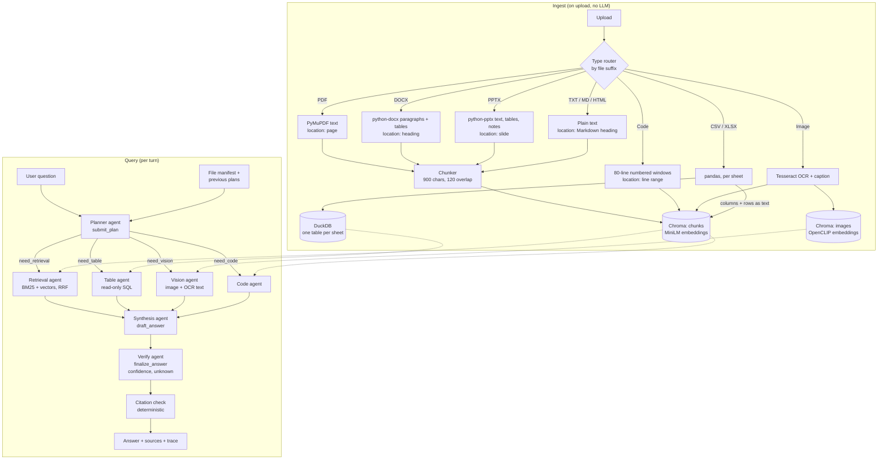

# document_chat

A multi-agent chat system for mixed file sets: PDF, DOCX, PPTX, Markdown, TXT, HTML, CSV, XLSX, images, and source code. You upload files into a conversation and ask questions across them. A planner routes each question to specialist agents (retrieval, table/SQL, vision/OCR, code). Their reports are merged by a synthesis agent and checked by a verification agent, which also returns a confidence score and an "I don't know" flag.

Everything except the LLM runs locally: embeddings, Chroma, DuckDB and SQLite. The default LLM is an open-weight model served by Groq, which has a free API tier. Switching `PROVIDER` to `ollama` makes the whole system run offline with no API key. OpenAI (or any OpenAI-compatible server such as vLLM) and Google Gemini are also supported.

This is a submission for **Option 1: Multi-Format Document/File Chat** of the BD AI Engineer case study.

> [!IMPORTANT]
> **For the best experience, use a paid/enterprise LLM provider** (OpenAI, Google Gemini, or a paid Groq tier). Each question makes 6–10 LLM calls across the agents, so the provider decides how fast and reliable the system feels:
>
> - **Local models (Ollama, vLLM)** work fully offline but are **slow** unless you have a powerful GPU. On a laptop CPU or small GPU, expect a minute or more per question, and small models mis-route tool calls more often.
> - **Groq's free tier** is fast but **heavily rate-limited**: about 7k input tokens per minute and 200k tokens per day. Expect `429 Too Many Requests` retries during normal use and a daily cap of a few dozen questions.
> - **Enterprise APIs** have much higher token-per-minute and per-day limits, and stronger tool calling. Answers are faster, 429s are rare, and routing and citations are more accurate.
>
> See [Model providers](#model-providers) for configuration.

---

## Contents

- [Architecture](#architecture)
- [Requirements](#requirements)
- [Setup](#setup)
- [Configuration](#configuration)
- [Model providers](#model-providers)
- [Embeddings](#embeddings)
- [Running](#running)
- [Docker](#docker)
- [Trying it with the test set](#trying-it-with-the-test-set)
- [Evaluation and tests](#evaluation-and-tests)
- [HTTP API](#http-api)
- [Data on disk](#data-on-disk)
- [Project layout](#project-layout)
- [Design decisions and trade-offs](#design-decisions-and-trade-offs)
- [Known limitations and future work](#known-limitations-and-future-work)
- [Troubleshooting](#troubleshooting)

---

## Architecture

There are two layers. **Ingest** is a deterministic pipeline that runs on upload, with no LLM involved. **Query** is a LangGraph/LangChain agent pipeline that runs per turn.



- Specialists run **in parallel** (`asyncio.gather`), and only the ones the planner selects are run. If one fails (rate limit, bad tool call), its error becomes its report and the rest of the turn continues.
- Each specialist has a tool-call budget (retrieval 3, table 4, vision 2, code 2) enforced by LangChain middleware, and repeated queries short-circuit. If a specialist hits its budget before writing a report, its raw tool results become the report. Recording tools (`submit_plan`, `draft_answer`, `finalize_answer`) end their agent immediately (`return_direct`), which saves one LLM call each.
- Every agent is a LangChain `create_agent` ReAct loop. Planner, synthesis and verify each have one "recording" tool whose arguments are the structured output: the plan, the draft, and the final answer.
- **Citations.** Every passage a tool returns starts with `[filename, location]`: page, slide, section, sheet, table or line range. After the verify agent, a deterministic check matches each citation in the answer against what the tools actually returned. Unverified citations are flagged in the UI and cap the confidence at 0.4; answers with no citations are capped at 0.5.
- **Images.** The vision agent gets relevant images as typed `text` + `image_url` block pairs (filename, caption, OCR text, then the pixels) in its input message. Several providers, Groq among them, reject images inside tool results, so `vision_tool` itself returns text only.
- **Conversation memory:** the planner sees the plans from earlier turns (intent, subqueries, target files), not the earlier transcripts. This keeps the prompt small while still resolving follow-ups like "and the West region?".
- Every agent step (tool call, tool result, message) is streamed as an event and stored on the assistant message as a `trace`. The UI shows it under "Agent trace".

A longer write-up of the design reasoning is in [`backend/docs/architecture.md`](backend/docs/architecture.md). That file covers why DuckDB was chosen over SQLite/Mongo for tables, the metadata-linking strategy, and the compaction plan.

---

## Requirements

| Requirement | Version | Why |
| --- | --- | --- |
| [uv](https://docs.astral.sh/uv/) | 0.12+ | Dependency and venv management (`uv.lock` is committed) |
| Python | **3.14** (pinned in `backend/.python-version`) | uv downloads it automatically if missing |
| Groq API key *or* [Ollama](https://ollama.com/download) | – | LLM: Groq free tier (default) or fully local Ollama |
| Tesseract OCR binary | 4.x / 5.x | OCR for images. `pytesseract` is only a wrapper around it |
| Disk | ~3 GB | PyTorch CPU wheels, OpenCLIP weights, one small LLM |
| RAM | 4 GB with Groq; 16 GB recommended with a local 7B model | Embeddings, plus the model when running Ollama |

No GPU is required. PyTorch is installed from the CPU wheel index.

---

## Setup

### 1. Clone

```bash
git clone https://github.com/karti358/document_chat.git
cd document_chat
```

### 2. Install system dependencies

Tesseract (needed for image OCR):

```bash
# Debian / Ubuntu
sudo apt install tesseract-ocr
# Fedora
sudo dnf install tesseract
# Arch
sudo pacman -S tesseract tesseract-data-eng
# macOS
brew install tesseract
```

Check it with `tesseract --version`. If Tesseract is missing, uploads still succeed, but images get empty OCR text.

### 3. Install Python dependencies

```bash
cd backend
uv sync
```

This creates `backend/.venv` and installs everything from `uv.lock`, including CPU-only PyTorch.

### 4. Configure the LLM

```bash
cp .env.example .env
```

**Option A: Groq (default).** Create a free key at <https://console.groq.com/keys> and set it in `backend/.env`:

```dotenv
PROVIDER=groq
API_KEY=<your groq key>
MODEL=qwen/qwen3.8-27b
```

**Option B: fully local with Ollama.**

```bash
curl -fsSL https://ollama.com/install.sh | sh   # Linux; macOS/Windows: use the installer
ollama serve                                    # if it is not already running as a service
ollama pull qwen2.5:7b                          # ~4.7 GB; lighter: qwen2.5:3b, llama3.2:3b
```

```dotenv
PROVIDER=ollama
MODEL=qwen2.5:7b
```

The agents work by **calling tools**, so the model must support tool calling. Models without it (for example `qwen2.5vl`) fail with `does not support tools (status code: 400)`. For Ollama, check with `ollama show <model>`: `tools` should appear under Capabilities.

See [Configuration](#configuration) for the other options.

---

## Configuration

Settings are read by `pydantic-settings` from environment variables and from `.env` in the **current working directory**. Run the commands from `backend/`.

| Variable | Required | Default | Meaning |
| --- | --- | --- | --- |
| `PROVIDER` | no | `groq` | `groq`, `ollama`, `openai`, or `google` |
| `MODEL` | yes | – | Model name for that provider (must support tool calling) |
| `API_KEY` | for hosted providers | empty | Provider API key. Not needed for `ollama` |
| `BASE_URL` | no | provider default | Custom endpoint, e.g. a remote Ollama host or a vLLM server |
| `DATA_DIR` | no | `data` | Where uploads, Chroma, DuckDB and SQLite live (relative to `backend/`) |
| `SQLITE_PATH` | no | `$DATA_DIR/document_chat.sqlite` | Override the metadata DB path |
| `MAX_RETRIES` | no | `6` | Retries with backoff for hosted providers (absorbs short rate limits) |
| `REQUESTS_PER_MINUTE` | no | `0` (off) | Client-side pacing of LLM calls, shared by all agents. `20` suits Groq's free tier |
| `VISION_IMAGES` | no | `true` | Attach images to the vision agent. Set `false` for text-only models |
| `CORS_ORIGINS` | no | `http://localhost:8501` | Comma-separated origins allowed to call the API from a browser |
| `LOG_LEVEL` | no | `INFO` | Python log level |

`backend/.env` is git-ignored. Never commit real keys.

---

## Model providers

One model serves all seven agents (planner, retrieval, table, vision, code, synthesis, verify). It is built in `backend/src/document_chat/config.py` (`get_client`).

> [!TIP]
> **Recommended: an enterprise provider** (`openai` with `gpt-4o-mini` or better, `google` with `gemini-2.0-flash`, or a paid Groq plan). The free and local options are good for trying the system out, but each has a real cost:
>
> | Option | Speed | Limits | Best for |
> | --- | --- | --- | --- |
> | Enterprise API (OpenAI, Gemini, paid Groq) | Fast | High token-per-minute and per-day quotas | Demos, evaluation, real use |
> | Groq free tier | Fast per call | ~7k input tokens/min, ~200k tokens/day, so frequent 429 retries | Short trials |
> | Ollama / vLLM (local) | Slow without a strong GPU | None, runs offline | Privacy, no API key |

| Provider | `PROVIDER` | LangChain class | Needs key | Local | Example `MODEL` |
| --- | --- | --- | --- | --- | --- |
| **Groq** (default) | `groq` | `ChatGroq` | yes (free tier) | no | `qwen/qwen3.8-27b`, `llama-3.3-70b-versatile` |
| **Ollama** (fully offline) | `ollama` | `ChatOllama` | no | yes | `qwen2.5:7b`, `qwen2.5:3b`, `llama3.1:8b`, `llama3.2:3b`, `qwen3:8b` |
| OpenAI | `openai` | `ChatOpenAI` | yes | no | `gpt-4o-mini` |
| OpenAI-compatible server (vLLM, LM Studio, llama.cpp server) | `openai` + `BASE_URL` | `ChatOpenAI` | server-dependent | yes | whatever the server exposes |
| Google Gemini | `google` | `ChatGoogleGenerativeAI` | yes | no | `gemini-2.0-flash` |

Examples:

```dotenv
# Enterprise (recommended)
PROVIDER=openai
MODEL=gpt-4o-mini
API_KEY=<your openai key>
REQUESTS_PER_MINUTE=0
```

```dotenv
# Groq (default)
PROVIDER=groq
MODEL=qwen/qwen3.8-27b
API_KEY=<your groq key>
```

```dotenv
# Fully local
PROVIDER=ollama
MODEL=qwen2.5:7b
```

```dotenv
# Local vLLM / LM Studio through the OpenAI-compatible API
PROVIDER=openai
BASE_URL=http://127.0.0.1:8001/v1
MODEL=Qwen/Qwen2.5-7B-Instruct
```

**Picking a model.** Choose one with reliable tool calling. The planner must call `submit_plan` and every specialist must call its tool. Small models (3B) run fast but mis-route more often. 7B–8B is the recommended local size.

**Vision.** The vision agent always gets the OCR text and caption. The image itself is attached only when `VISION_IMAGES=true`, which requires a model that accepts image input (the default Groq model does). With a text-only model, set `VISION_IMAGES=false` and the vision agent answers from OCR and caption text.

**Groq free-tier limits.** A turn uses roughly 10–20k tokens across the agents. The free tier allows about 7k input tokens per minute and 200k per day for this model, so expect retries (handled by `MAX_RETRIES` and `REQUESTS_PER_MINUTE`) during rapid questioning, and a daily cap of a few dozen questions. For anything beyond a short trial, switch to an enterprise provider.

**Local models (Ollama, vLLM).** There are no quotas, but every one of the 6–10 calls per turn runs on your hardware. Without a strong GPU (roughly 16 GB+ VRAM for a 7B–8B model at good speed), a question can take a minute or more. Smaller models are faster but less reliable at tool calling.

---

## Embeddings

Embeddings are computed locally by Chroma's built-in embedding functions. No API calls are made and no Ollama model is needed for embeddings.

| Collection | Content | Model | Size | Loaded |
| --- | --- | --- | --- | --- |
| `chunks` | Text chunks from PDF / DOCX / PPTX / MD / TXT / HTML, code windows, and image OCR+caption text | `all-MiniLM-L6-v2` (ONNX, Chroma `DefaultEmbeddingFunction`) | ~80 MB | On first use; downloaded to `~/.cache/chroma` |
| `images` | Raw images | OpenCLIP `ViT-B-32` / `laion2b_s34b_b79k` (Chroma `OpenCLIPEmbeddingFunction`) | ~600 MB | Lazily, on the first image upload or image query |

- Both downloads happen once and need network access on first run. After that the system works offline.
- The image collection lets text queries like "the scanned invoice" find the image through CLIP's shared text/image space. Each image also gets a normal text chunk (caption + OCR) in `chunks`, so it is found by regular text search too.
- **Spreadsheets are answered through SQL.** CSV/XLSX sheets go into DuckDB for the table agent. Each sheet also gets a text chunk with its columns and first 200 rows, so retrieval can discover which sheet mentions an ID. Numbers are always computed by SQL.
- **Changing models.** The embedding functions are set in `backend/src/document_chat/services/index/chroma_store.py`. If you change them, delete `backend/data/chroma/` and re-upload. Vectors from different models are not compatible.

---

## Running

All commands run from `backend/`.

### Streamlit UI (recommended for the demo)

```bash
cd backend
uv run document-chat-ui
```

Open <http://127.0.0.1:8501>.

- **Left sidebar:** conversations. **+ New chat** creates one; click a title to open it, and × deletes it.
- **Right panel:** documents for the current conversation. Upload one or many files, see their parse status and chunk count, and remove them with ×.
- **Centre:** chat. Under each answer:
  - a confidence badge
  - an "I don't know" badge when evidence is missing
  - one source badge per citation, red if it didn't come from any tool result
  - an expandable **Agent trace** with the plan, every tool call and result, and timings

  The × under a turn deletes that question/answer pair.

The UI calls the same Python services as the API, in-process. The API server does **not** need to be running for the UI.

### FastAPI server (optional)

```bash
cd backend
uv run document-chat
```

API on <http://127.0.0.1:8000>, interactive docs at <http://127.0.0.1:8000/docs>.

The UI and the API share `backend/data/`. They can run at the same time, but it is simplest to use one of them for uploads during a demo.

### Resetting state

Stop the processes and delete `backend/data/`. It is recreated empty on the next start. Documents uploaded before an upgrade keep their old index entries. Re-upload them to get page, slide and line locations.

---

## Docker

One command, from the repository root, after creating `backend/.env`:

```bash
docker compose up --build            # UI on http://127.0.0.1:8501
docker compose --profile api up      # also start the API on :8000
```

Without Compose:

```bash
docker build -f backend/Dockerfile -t document-chat .
docker run --rm -p 8501:8501 --env-file backend/.env -v document_chat_data:/data document-chat
```

The image includes Tesseract. Data lives in the `document_chat_data` volume. With `PROVIDER=ollama`, the container reaches Ollama on the host through `host.docker.internal` (`OLLAMA_HOST`). On Linux, Ollama must listen on all interfaces for this (`OLLAMA_HOST=0.0.0.0 ollama serve`).

---

## Trying it with the test set

`document_chat_test_set/` contains a small synthetic corpus built to exercise cross-format reasoning. It covers a fictional vendor (Acme), a purchase order (PO-1042) that appears in every file, and a possible duplicate payment.

| File | Tests |
| --- | --- |
| `vendor_policy.md` | Text retrieval (refund window, Net-30) |
| `contract_acme.pdf` | PDF retrieval (vendor, PO, signing date) |
| `q3_invoices.xlsx` | Table SQL (duplicate PO rows, totals) |
| `q3_summary.csv` | Table SQL (regional totals, reconciliation) |
| `q3_review.pptx` | Slide retrieval ("Acme paid twice on PO-1042") |
| `invoice_scan.png` | OCR / vision (PO number, amount) |
| `reconcile.py` | Code explanation (`flag_duplicate_po_ids`) |
| `readme.txt` | Corpus description |

Upload all eight files into one conversation. Then try questions from [`document_chat_test_set/document_chat_questions.md`](document_chat_test_set/document_chat_questions.md), which lists the expected answers and sources. Good demo questions:

- *What is the refund window in the vendor policy?* (single document, retrieval)
- *How much do the two PO-1042 invoices total?* (table SQL)
- *Do the regional totals in the CSV reconcile to the spreadsheet?* (joins across two tables)
- *What amount is shown on the scanned invoice?* (OCR / vision)
- *What does `reconcile.py` do?* (code)
- *What evidence supports the statement that PO-1042 may have been billed twice?* (cross-document: slides + sheet + image + code)
- *Does the document set show INV-240701 was actually paid on August 4?* (should answer "No", because there is no payment record)

---

## Evaluation and tests

### Question-bank evaluation

`document-chat-eval` runs questions from `document_chat_questions.md` through the full agent pipeline. It uses an isolated index in `backend/data/eval_run/`, so your uploads are untouched.

```bash
cd backend
uv run document-chat-eval --ids 1,2,3,5,7,8,13,23,36,37   # a representative subset
uv run document-chat-eval --limit 20 --pause 20             # first 20, spaced out for rate limits
```

Grading is deterministic, with no judge LLM:
- **Answer check:** every **bold** value in the expected answer must appear in the answer. Numbers are compared by value, dates in any common format, and yes/no against the first sentence.
- **Source recall:** the share of expected source files that the answer cited with a verified citation.

Results go to `backend/data/eval_run/eval/report.md` and `results.json`.

A first run on the default Groq model, over the subset above: 8 of the 8 questions that completed were answered correctly, with 89% mean source recall and 0 unsupported citations. The other two hit the free-tier daily token limit.

### Unit tests

```bash
cd backend
uv run pytest -q
```

Covers parsers and their locations, the DuckDB SQL guard, BM25/RRF and hybrid search, citation verification, and eval grading. The tests need no LLM or network, apart from the one-time embedding model download.

---

## HTTP API

| Method | Path | Purpose |
| --- | --- | --- |
| `POST` | `/conversations` | Create a conversation |
| `GET` | `/conversations` | List conversations |
| `GET` | `/conversations/{id}` | Get one, with messages and documents |
| `DELETE` | `/conversations/{id}` | Delete a conversation and its documents |
| `POST` | `/conversations/{id}/documents` | Upload files (multipart field `documents`, repeatable) |
| `DELETE` | `/conversations/{id}/documents/{doc_id}` | Remove a document and its index entries |
| `GET` | `/conversations/{id}/documents/{doc_id}/file` | Download the original file |
| `DELETE` | `/conversations/{id}/messages/{msg_id}` | Delete a question/answer turn |
| `POST` | `/conversations/{id}/chat` | Ask a question. Body `{"prompt": "..."}`. Response is Server-Sent Events |
| `GET` | `/documents`, `/documents/{id}`, `/documents/{id}/file` | Global document listing and download |
| `PUT` / `DELETE` | `/documents/{id}` | Replace or delete a document |

Example:

```bash
CID=$(curl -s -X POST localhost:8000/conversations | python -c 'import sys,json;print(json.load(sys.stdin)["id"])')
curl -s -X POST localhost:8000/conversations/$CID/documents \
  -F documents=@../document_chat_test_set/vendor_policy.md \
  -F documents=@../document_chat_test_set/q3_invoices.xlsx
curl -N -X POST localhost:8000/conversations/$CID/chat \
  -H 'Content-Type: application/json' \
  -d '{"prompt": "How much do the two PO-1042 invoices total?"}'
```

The chat stream emits these events:
- `agent_start`, `tool_call`, `tool_result`, `message`, `agent_done` as each agent works
- `agent_error` when a specialist fails
- `citations` after the citation check
- a final `done` with the updated conversation, or `error` if the turn fails

---

## Data on disk

Everything lives under `backend/data/` (configurable with `DATA_DIR`):

| Path | Store | Content |
| --- | --- | --- |
| `documents/` | Filesystem | Original uploaded files |
| `document_chat.sqlite` | SQLite | Conversations, messages (with plans and traces), document records. Each table is `id` + `json` |
| `chroma/` | Chroma | `chunks` (text/code/OCR) and `images` (CLIP) collections |
| `tables.duckdb` | DuckDB | One table per CSV / XLSX sheet, named `t_<document_id>_<sheet>` |

---

## Project layout

```
document_chat/
├── README.md                      # this file
├── docker-compose.yml
├── document_chat_test_set/        # sample corpus + question set with expected answers
└── backend/
    ├── Dockerfile
    ├── pyproject.toml / uv.lock
    ├── .env.example
    ├── .streamlit/config.toml     # UI theme
    ├── docs/architecture.md       # design decisions in depth
    ├── tests/                     # pytest suite (no LLM needed)
    └── src/document_chat/
        ├── api.py                 # FastAPI app, `document-chat` entry point
        ├── eval.py                # question-bank runner, `document-chat-eval`
        ├── config.py              # settings + LLM provider factory
        ├── routers/               # /conversations, /documents
        ├── db/sqlite_store.py     # id+json SQLite tables
        ├── ui/app.py              # Streamlit app, `document-chat-ui` entry point
        └── services/
            ├── chat.py            # streams one turn, persists the result
            ├── ingest.py          # parse → index on upload
            ├── parsers/           # pdf, office, text, tables, images, code, chunking
            ├── index/             # chroma_store, table_store (DuckDB), retrieval
            ├── agents/            # orchestrator (agents + tools), prompts, citation check
            ├── conversations/     # conversation storage service
            └── documents/         # upload storage service
```

---

## Design decisions and trade-offs

- **Specialists by tool, not by persona.** An agent exists only if it has its own tool, its own failure mode, or can run in parallel. Each extra local-LLM hop costs seconds.
- **Ingest is a pipeline, not an agent.** Parsing, OCR and chunking are deterministic and cheap to re-run. No LLM runs on upload, so large uploads don't stall on model calls.
- **Spreadsheets go to SQL, not the vector store.** Aggregations, filters and joins run in DuckDB. The table agent gets the schema plus three sample rows and writes one read-only `SELECT`. Numbers come from the engine, not from the model doing arithmetic.
- **SQL guardrails.** Only a single `SELECT`/`WITH` is allowed:
  - DDL/DML keywords are rejected.
  - DuckDB file functions (`read_*`, `*_scan`, `glob`) and quoted file paths are rejected.
  - The connection is read-only.
  - Queries may only touch this conversation's tables.
  - Results are capped at 50 rows.
- **Hybrid retrieval with rank fusion.** BM25 catches exact IDs like `PO-1042` and `INV-240701`, which embeddings blur. Vectors catch paraphrases. Reciprocal rank fusion merges the two lists without tuning score scales. BM25 is computed in memory over the conversation's chunks. That is fine for tens of files, but it would move to SQLite FTS5 or a search engine at scale.
- **Two-stage verification.** An LLM verify pass drops unsupported claims and sets `confidence`/`unknown`. Then a deterministic check makes sure each cited `[file, location]` really came back from a tool. The LLM pass handles meaning; the code check catches citations the model made up, which LLM self-checks tend to miss.
- **Plans as memory.** Earlier plans are passed to the planner instead of the full chat history. This keeps latency and context small, at the cost of losing nuance from earlier answers.
- **Images in the agent's input, not in tool results.** This is portable across providers. The pairing of caption, OCR text and image is kept as typed content blocks.
- **Failure isolation.** A failing specialist becomes a report that says it failed, so synthesis and verify can answer "I don't know" rather than the turn erroring out.
- **One local process, zero services.** Chroma, DuckDB and SQLite are all embedded. The only external dependency is the LLM endpoint. Qdrant or Postgres would be the scale-up path.

---

## Known limitations and future work

- **No cross-encoder reranker.** Hybrid search plus RRF is the final ranking. A BGE reranker over the top ~20 would sharpen close calls, for example a policy section versus code for "duplicate detection".
- **Citation check is per citation, not per claim.** It proves each cited location was really returned by a tool. It does not prove that the sentence next to it is entailed by that passage. That still relies on the LLM verify pass.
- **PDF layout.** PDFs use PyMuPDF plain text per page. PDF tables are not reconstructed as tables. Docling is the planned upgrade.
- **Image captions at ingest are built from OCR text and image dimensions.** Real visual understanding happens at query time in the vision agent, and only with a vision-capable model.
- **One model for all agents.** A small fast router model plus a stronger synthesis model would cut latency and token use.
- **Latency and tokens.** A turn is 4–6 LLM calls, about 10–20k tokens. On Groq's free tier, rate limits dominate: expect 15–90 s per question. With a local 7B model, expect 20–60 s.
- **Eval coverage.** The runner grades 88 of the 118 questions automatically. The rest have open-ended expected answers and need manual review or a judge model.
- **Docker image not yet verified on a clean machine.**
- **Not planned for this scope:** audio/video transcripts, web crawling, entity-link graph across documents (designed in `docs/architecture.md` §8), trace compaction.

---

## Troubleshooting

| Symptom | Cause / fix |
| --- | --- |
| `ResponseError: ... does not support tools (status code: 400)` | The Ollama model has no tool calling. Pull and set a tool-capable model (`qwen2.5:7b`, `llama3.1:8b`) |
| `ValidationError ... model Field required` on start | Copy `.env.example` to `backend/.env` and set `MODEL` |
| `401` / `invalid api key` from Groq | Set `API_KEY` in `backend/.env` |
| Settings seem ignored | Commands must run from `backend/` so `.env` is found |
| Image answers say OCR is empty | Install the Tesseract binary and re-upload the image |
| First upload or query is slow | One-time download of MiniLM (text) or OpenCLIP (images) weights |
| `Connection refused` to `127.0.0.1:11434` | Start Ollama: `ollama serve` |
| `ValueError: <Token ...> was created in a different Context` | Stale process from older code. Restart the UI/API |
| Frequent `429 Too Many Requests` / "Retrying request" | Per-minute limit. Set `REQUESTS_PER_MINUTE=20`; retries still absorb the rest. Specialists are capped at 2–4 tool calls per turn, so a turn is typically 6–10 requests |
| `RateLimitError ... tokens per day (TPD)` from Groq | Daily free-tier quota used up. Wait, switch to Ollama, or use another key |
| `messages[n].content must be a string` from the vision agent | The model is text-only (e.g. `openai/gpt-oss-20b`). The agent now retries with OCR text and skips images for the rest of the process; set `VISION_IMAGES=false` to avoid the wasted first request |
| Answers cite files but show no page/slide | Documents were indexed before locations existed. Re-upload them |
| Strange results after changing embedding models | Delete `backend/data/chroma/` and re-upload |
